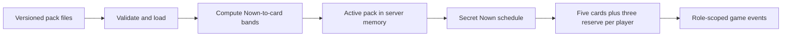

# Module: Server content and dealing

> **Current-runtime audit, not the text target.** The source observations below
> were recorded on 2026-09-11 and cross-checked for transition planning on
> 2026-09-12. The [Blueprint](../../BLUEPRINT.md) now specifies five text-only
> modes under [ADR-012](../design/ADR-012-text-only-selectable-modes.md).
> Image delivery, specialties and association-game dealing described here
> remain in the checked-in runtime; this documentation change fixes none of
> those paths. Use the [transition design](../design/DESIGN-text-transition.md)
> and current [Roadmap](../planning/ROADMAP.md) for replacement work.

## Purpose

Explain the current path from a content pack to Nowns and player hands before
authoring real content. This is a source audit dated 2026-09-11, not a replacement
for the target rules in [Blueprint](../../BLUEPRINT.md). Editorial standards
live in [Humor development](../../content/humor-development.md) and the
[Curator Guide](../../content/curator-guide.md).

## Public surface

| Component | Responsibility |
|---|---|
| [`server/pkg/media`](../../server/pkg/media/) | Pack format, checksum validation, relevance bands, dealing, certification, signed URLs and active pack manager. |
| [`tools/mediapack`](../../tools/mediapack/cmd/mediapack/main.go) | Current commands: `build`, `certify`, `simulate`, `publish`. |
| [`game.Match`](../../server/internal/game/match.go) | Secret roles/Nown schedule, hands, draws, specialties, rounds and votes. |
| [`PayloadRenderer`](../../server/internal/game/payload.go) | Per-recipient Nown/decoy and media payloads. |
| [Contributor Studio](../guides/COMMUNITY_OPERATIONS.md) | Text drafts, submission and review; acceptance is separate from pack release. |

## Internals

### Content storage and loading

`manifest.json` identifies the pack, language, embedding model/version and
checksums; `media.jsonl` contains Nowns; `cards.jsonl` contains playable prompts.
Text lives in the item data; static images use asset references. These are the
only playable media formats in the current loader under the historical
[ADR-011](../design/ADR-011-static-image-and-text-content.md) contract. MinIO is
still configured in the current stack; the text target uses server-local
versioned bundles and retires playable object-storage delivery.

The candidate preparation tool accepts static PNG/JPEG/WebP inputs and writes
static WebP. Pack validation accepts only image/text item types and fully
decoded static WebP assets within the 720 px longest-side limit; a GIF, an
animated WebP/APNG or another format renamed as an image is not a valid pack
asset. `ValidatePackContent` runs during loading, certification and bundle
writing. This format validation does not complete the moderation, embedding
or production activation pipeline below.

Startup loads `media.local_bundle_path` synchronously and refuses to start
without a usable pack. `LoadPack` validates the bundle and computes band lists
in memory. New matches receive the active pack from the lobby manager. Match
state is in memory; PostgreSQL stores contribution workflow and durable player
data, rather than supplying a fresh database query for every card draw.
See [startup](../../server/cmd/knowoffd/main.go),
[loader](../../server/pkg/media/loader.go) and
[lobby manager](../../server/internal/lobby/manager.go).

The checked-in [development pack](../../content/packs/core-2026.10/manifest.json)
has **150 text Nowns and 5,400 text cards**, with manifest tag
`synthetic-20260820` despite its directory name `core-2026.10`. Its
`synthetic-deterministic` embeddings are two-dimensional fixture vectors;
they do not establish semantic relevance or comic quality for real text.
[ADR-005](../design/ADR-005-synthetic-seed-pack.md) explains why a synthetic
development pack exists.

### Relationships and chances

For content tasks, automatically follow the
[server and client source map](../../content/curator-guide.md#read-the-dealing-path-before-authoring)
before proposing High/Distant/Chaos relationships. It identifies the dealer,
match actions, payload privacy, client state and rendering paths; the client
displays server-owned outcomes rather than calculating relevance bands.

The [mesh](../../server/pkg/media/dealing.go) compares each Nown vector with
every card vector using cosine similarity. Current defaults in
[tuning.yaml](../../configs/gameplay/tuning.yaml) are:

| Similarity to a particular Nown | Band |
|---|---|
| At least 0.55 | High |
| At least 0.30, below 0.55 | Distant |
| Below 0.30 | Chaos |

A card can occupy different bands for different Nowns. There is no explicit
card-to-card dependency graph, exclusive deck per Nown or automatic chain of
callbacks. Tags, tone buckets, editorial shelf life and popularity do not
weight current draws. In particular, the chaos tone bucket is independent of
the chaos similarity band, and the editorial 70/20/10 mix is not a draw rule.
Similarity is neither a funniness rating nor a correct-answer score: a player
can legally play an unrelated card and argue for it; voting decides outcomes.

At match start, the server shuffles the pack's Nowns and takes **two at four
players, three at six players**. The schedule is secret and the match may end
before all scheduled rounds. With the current 150-Nown pack, each Nown has a
**1/150 chance of first position**, and **2/150 or 3/150 chance of selection
somewhere in the schedule**. Undersized packs repeat the last available Nown.
Ordinary match startup seeds the RNG from the current time and logs that seed;
it does not pass the tuning file's example seed into each live match.

### Actual hands and personal reserves

The current dealer samples **two high and two distant cards against the first
Nown**, then fills the fifth slot from all remaining bands. That filler may
also be high or distant: it is not guaranteed chaos. The next Nown contributes
only the first three selected cards (two high, one distant) to the personal
reserve. Once all eight slots are full, selections for later Nowns are not
retained, although sampling those bands can still fail.

Cards are sampled without duplication within one player's eight cards.
Different players may receive the same card: there is no table-wide stock
being depleted. Chances for an individual card depend on its candidate bands,
their sizes and earlier selections; there is no single rarity percentage.
The same process applies to Nowers and Donowers.

Playing or timing out removes a card from the hand. New rounds do not refill
ordinary cards or recycle discards. A draw takes the next card(s) from the
front of that player's reserve; the configured default penalty is five points
per card, except the draw covered by One More Free Card. See
[match actions](../../server/internal/game/match.go).

Each player receives one specialty at match start, selected separately and
role-blind. Held specialties carry over between rounds; spent specialties are
not refreshed. Its defaults are normalized weights, not independent drop chances:

| Specialty | Weight | Chance when selected |
|---|---:|---:|
| Pass | 0.10 | 31.25% |
| Reveal | 0.04 | 12.5% |
| One More Free Card | 0.08 | 25% |
| Shuffle | 0.05 | 15.625% |
| Revote | 0.05 | 15.625% |

### What currently gets into the app

The CLI's `build` command invokes `SyntheticPack`; `certify` and `simulate`
check that format/dealing implementation; `publish` copies a directory.
They do not provide the adopted text production workflow or the previous
image/text production pipeline. The current
Admin submission-publish operation returns HTTP 501. Editing or approving a
text submission therefore does not add it to the active game pack.

The current loader requires embeddings, including for text. Under the adopted
target, reviewed mode suitability and full-schedule/action viability replace
mandatory multimodal geometry as the production requirement; optional text
embeddings must be versioned and validated when used. Editorial review, bundle
validation, human playtests and verified activation remain separate gates.
A synthetic build is not a production pilot. The original
[content readiness audit](../planning/ROADMAP-pre-text-20260912.md#content-readiness-audit--2026-09-11)
is retained as historical evidence.

## Invariants and current gaps

Initial hands/reserves are private. During a round, active Nowers receive Nown
and Donowers/eliminated players receive `{decoy: true}`; text is inline and
static-image media uses signed URLs. The final verdict reveals Nowns from rounds
actually begun.

The following gaps were found against the earlier contract; the transition
must resolve or retire them with replacement proofs:

- **All-Nown balance:** the eight retained cards are not checked for the
  required coverage against every scheduled Nown. Certification checks band
  availability and repeated deal success, not final retained-hand coverage.
- **Shuffle preservation (historical):** Shuffle replaces the whole
  `PlayerHand`, including the reserve, and clears specialties. The earlier
  contract required reserves to remain untouched. The text target removes
  Shuffle and all other specialties rather than completing this old mechanic.
- **Draw timing and privacy:** the draw handler accepts active connected
  players during the play phase without requiring their turn, and broadcasts
  actual drawn cards to everyone. The intended announcement is who/how many,
  with card identities private. An existing test explicitly expects out-of-turn
  drawing; this is a spec/implementation conflict to resolve, not missing coverage alone.
- **Pack isolation:** the match retains its original pack for dealing, but
  payload rendering resolves IDs through the global active manager. A hot swap
  can therefore break rendering in a running match.
- **Production pipeline:** complete reviewed text ingestion, mode suitability,
  action certification and activation remain open. Replacing fixture text while
  retaining synthetic vectors is insufficient production evidence.

These are pending engineering work, not new game rules. A passing current
test suite or simulator does not prove the missing guarantees. Human playtests
must also judge recognition, laughter and plausible alternative explanations.

## Tests

- [Media tests](../../server/pkg/media/media_test.go) cover bands, certification,
  integrity and dealing; the current deal-constraints test checks sizes rather
  than retained-hand coverage for every Nown.
- [Fixture tests](../../server/pkg/media/fixture_test.go) exercise golden and
  band-starved packs; [manager tests](../../server/pkg/media/manager_test.go)
  exercise active pack management.
- [Payload tests](../../server/internal/game/payload_test.go) and
  [match tests](../../server/internal/game/match_test.go) cover role scoping,
  draws, specialties and turns, subject to the gaps above.

Run the repository gate with `python3 xops/test/tests-lints.py`. Its current
coverage does not include the separate `tools/mediapack` Go module, candidate
preparation Python tests or `tools/gamebot` module. Required PostgreSQL suites
can skip if their disposable database is unavailable. Record those limits;
the transition gate must include every retained module and required integration
proof, with no missing service mistaken for success.

## Dependencies

The game and CLI share `server/pkg/media` ([ADR-004](../design/ADR-004-media-package-in-server-pkg.md)).
Gameplay values come from `configs/gameplay/tuning.yaml`; source records and
editorial decisions accompany content curation; role and contribution review
state remains in the existing Portal/Admin workflow.

## Additional transition boundaries — 2026-09-12

- **Pinned text:** the match renderer must resolve content through the same
  immutable pack snapshot as its dealer. New activation cannot change earlier
  wording, current hands, system seeds, history or reconnect payloads.
- **No bulk prompt metadata:** the existing
  [pack sync service](../../client/lib/media/pack_sync_service.dart) fetches and
  persists `media.jsonl`, which contains literal text Nowns and metadata. Its
  parsing/format-version check is not checksum verification. Do not connect
  this service to text gameplay; authorized inline text replaces the playable
  metadata/prefetch route. Retire the three `media.*` preference keys and old
  asset caches while preserving account credentials.
- **Distinct copies and evidence:** current string card IDs and per-round
  seat-to-card plays cannot express reserved trades, replacement destinations
  or complete match history. Separate content revision from instance identity;
  certify conservation, atomic actions, role-scoped history and bounded frames.
- **Storage and builds:** current startup only loads `media.local_bundle_path`,
  while readiness still probes MinIO. A storage configuration is not an
  implemented S3 publisher. Remove game-only storage prerequisites after
  dependency proof. Preserve avatar encoding in
  [avatar.go](../../server/internal/avatar/avatar.go), which still requires
  native WebP/CGO; text gameplay does not eliminate that build prerequisite.
- **Safe retirement:** applied SQL, licensed historical material, consent,
  reports and entitlement references remain auditable. Remove obsolete image,
  specialty and backfill execution paths through the transition inventory;
  replacing a current regression test requires equivalent new-contract proof.
