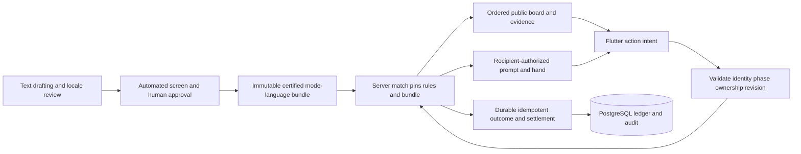

# Design: Text-only transition and system integrity

**Status:** Phase 1 technical baseline and design proofs verified, 2026-09-12.
**Authority:** [Blueprint](../../BLUEPRINT.md) owns the rules; [Roadmap](../planning/ROADMAP.md)
owns the ordered work. [ADR-012](ADR-012-text-only-selectable-modes.md) records
the pivot. [Business plan](../product/BUSINESS_PLAN.md) owns commercial hypotheses.
This design is an implementation handoff and source evidence, not another roadmap.

## Goal and boundaries

Transition all five modes without losing user value, exposing secret state or
leaving a dormant copy of the old game. Preserve shared account/community/UI
capabilities and their tests. The original planning pass changed no executable
code or deployed state. The [foundation report](../reports/2026-09-12-text-phase1-validation.md)
records subsequent local implementation and its limits. Current source references
were inspected through CodeGraph on 2026-09-12; line numbers can move after
implementation. Production data, traffic and active purchases were not inspected.
Historical test success does not certify current gaps, and none of the new
protocol fields below reach the live runtime merely because they are specified here.

## Target data flow and ownership

Use one shared game state machine with discriminated per-mode board state; no
five cloned engines or client-side dealer. Keep `server/pkg/media` as the shared
Go boundary (ADR-004) unless a later concrete rename removes confusion at small
cost. The historical name has real consumers; sole-use obsolete behavior does not.

### Proposed v2 schema contract

Freeze exact fields and JSON fixtures in Roadmap Phase 1. These names are planned,
not claims of current endpoints. Integer quantities must be integral and bounded;
unknown mode/action/version or contradictory fields are errors.

| Record | Required target data |
|---|---|
| Lobby settings | mode ID, size 4/6, content language, eligible pack release, settings/membership revision, host, per-seat Ready acknowledgement |
| Match contract | unique match ID distinct from reusable room ID, original size, mode/rules/protocol versions, content language/release/hash, pinned tuning, server-owned reward eligibility |
| Content record | content ID, immutable revision, exact text, language, prompt/response/item kind, mode suitability, source/license/review/certification links |
| Card instance | opaque match-unique instance ID, content ID/revision, current owner/zone; never encode role or secret in IDs |
| Action request | request ID, match/round/turn/phase identity, expected board revision, discriminated payload (card instance, rating/slot/target/offer/resolution as required) |
| Public action | event/action ID, sequence, original round, actor/system attribution, public copy references, before/after board revision, reason, server timestamp/deadline |
| Snapshot | matching contract, through-sequence cursor, current phase/turn/deadline, all public history and board, pending offer, owner-authorized private state and legal capabilities |
| Durable settlement | match/account identity, result classification, immutable award-event keys, processing state/outbox retries, quota/leaderboard day keys and reconciliation status |

A copy exists in exactly one location: hand, reserve, board/display or spent
pool. An offer reservation marks existing copies unavailable; it must not create
new ownership locations or duplicate copies. History references a copy without
owning it. On accept, swap locations/owners once; on refusal/timeout/cancel,
unreserve both once. System seeds create explicit extra copies at round start;
retired boards enter spent history at reset. Tests assert the multiset of all
instances is conserved except for this explicitly recorded seeding.

A request cache records outcome/identity, not a permanently reusable secret
payload. Repeated requests must reauthorize the response against the recipient's
current role/elimination state; old private prompt replies never bypass the
snapshot renderer. Each connection has one serialized outbound writer. Client
pending requests carry IDs and are reconciled against snapshot/phase before
retry; a reconnect is not permission to auto-play a stale preview.

Full history is bounded by match length and bounded request/action counts.
Prototype a worst-case six-seat/three-round trace including draws, penalties,
trade offers/results and ballots against the configured frame maximum. If a
snapshot exceeds it, use versioned public-history pages with cursor/hash and
bounded assembly; do not silently truncate evidence or send private raw scripts.
Use separate public `evidence_seq` and per-recipient `recipient_seq` within a
new `stream_epoch` on reconnect. Match snapshots and authenticated match-action
`ErrorEvent` messages consume only that recipient stream; messages to another
seat cause no gap. A typed rejection advances `recipient_seq` with unchanged
`evidence_seq` and board revision. Pages bind to their snapshot cursor and do not
consume a second sequence. Hello, lobby/queue controls, acknowledgements and
private terminal settlement deliveries are outside the match cursor. A snapshot
sets both cursors atomically at a serialized match revision; stale epochs are
ignored. Internal action ordering remains common. The shared v2 fixtures freeze
these fields and snapshot/page sequencing.

Authored chat has a narrow recipient-specific visibility projection. A block or
unblock may replace only a chat event's authored `text` with
`phrase_id: "chat.hidden"`, or restore that same authored text. Every other field
(actor, event ID, evidence sequence, phase, round, locale, cards and revisions)
remains identical. Clients retain a fingerprint of any previously observed
wording and reject text A → hidden → text B. Initially hidden wording can first
be learned only from an authenticated complete projection. Exact hashes still
bind each snapshot and history page; gameplay history has no redaction exception.

Result snapshots carry `result_reveal_at_ms`, derived from the pinned
`timers.vote_result_falling` duration and result start. Before that boundary the
server withholds the voted player's role and newly earned displayed points;
the points remain committed internally and role-linked Noin stays private until
match end. The server wakes at the reveal boundary to send the role-result
poster, then at the existing result deadline. Unanimous active-connected Ready
may finalize early under the unchanged rule. A reveal timestamp is forbidden
outside the result phase; clients never infer it from half the remaining timer.

The Phase 1 v2 fixture contract defines `Board.Revision` as monotonic across the
whole match, including round boundaries. Snapshots include ordered seats and
the current acting seat, ballot candidates/votes/deadline and readiness state.
History pages bind to the snapshot's match, round, board revision and evidence cursor;
assembly rejects gaps, altered hashes and inconsistent context. Page SHA-256
uses recursively sorted ASCII schema keys, compact UTF-8 JSON, decimal integers
and only JSON-required escaping (Unicode and HTML stay literal). The independent
Dart golden test recomputes that encoding; it does not certify the future client
reducer, live sequence assignment or reconnect integration.

### Validation and failure behavior

- Preflight pack, role counts, connected readiness and access before match start;
  a failed deal returns a coherent lobby/queue and releases quota reservation.
- Reject wrong actor/phase, non-owned copy, stale revision, invalid rating/slot,
  self/disconnected trade target, unknown offer and late action without mutation.
- Use server deadlines/clock reference; replay or reconnect cannot reset clocks.
  The first valid server-serialized offer response/timeout/leave wins.
- Round reset retires board seeds, keeps hands/reserves and earlier evidence;
  forced end cancels a pending offer before outcome/settlement.
- On malformed rendering or unavailable pinned content, fail closed and surface
  an operational failure; never silently substitute a secret/pack/language.
- Process loss has no live-state restoration promise. Mark interruption, retain
  durable event rewards, reconcile partial settlement, return clients cleanly. A confirmed process-loss
  interruption compensates consumed free-Quick-Play allowance exactly once; it
  cannot mint completion/team/first-win/points/XP/leaderboard credit from lost
  state or extend subscription/pass expiry. Preserve already committed awards,
  and distinguish this from a player deliberately disconnecting.
- No secret schedules, raw hands, RNG seeds or replay scripts in ordinary logs,
  analytics, downloaded catalogs or report screenshots. Privileged evidence has
  access controls and a documented retention limit.

## Contract decisions and remaining owner evidence

The selected five-mode mechanics, 5+3 prototype budget, first default, ten-second
trade reply, shared economy and initial backfill/specialty exclusion are adopted
planning defaults. Playtests may revise them under versioned spec/roadmap updates.
This is enough to implement local contracts without repeatedly asking permission.
The following require real owner/operator evidence before the dependent release:

| Decision / evidence | Owner and blocking point |
|---|---|
| Existing deployed users, purchases, legacy image submissions and object use | Operator inventory before migration/cutover; never assume none |
| Legacy paid-pack equivalence or compensation | Product/finance owner before old benefit retirement; preserve balances and provider provenance |
| Initial enabled languages, modes/cohort windows and staffed review hours | Product/content leads before public exposure; all five remain intended |
| Cash, hourly capacity, burn ceiling and current platform/provider costs | Owner before paid acquisition or procurement; business scenarios are assumptions |
| Retention/deletion policy, live terms/privacy URLs, age/store/billing/consent obligations | Owner with appropriate review before public collection/store submission; no placeholder is a legal conclusion |
| Rollback observation window, acceptable recovery point/time and archival retention | Operator/owner before cutover; default no data loss and no destructive contract step without demonstrated recovery |
| Concrete obsolete test-file deletions | Owner at retirement boundary under AGENTS.md §3, after replacement proof and exact file list exist |

## Current runtime audit

### A. Draw authority/privacy is incompatible, and an existing test deliberately preserves it

- `server/internal/game/match.go:1036`, `handleDrawCards`: checks play phase but not `turnOrder[currentTurn] == seat`; converts arbitrary JSON float to int, defaults nonpositive count to one, clamps overdraw; actual `cards` go into `drawPayload` at 1071 and are broadcast to everybody at 1076.
- `server/internal/game/match_test.go:341`, `TestMatch_OutOfTurnDrawAllowed`, asserts non-current players can draw and the current turn remains unchanged. This is a deliberate current behavior, not a missing test.
- Target: turn-only optional draws, no draw during pending trade, integer count validation, owner-only card delivery, public seat/count evidence, exactly-once penalty and reserve movement, no automatic refill. Replace contradictory test with explicit adopted-contract regression; preserve penalty and keep-turn proofs at 437 and 451. Never simply weaken the old assertion.

### B. Current state cannot represent the selected modes or preserve their evidence

- `server/internal/game/match.go:16` Match contains `plays map[int]string` at 51 and `lostCards map[int]string` at 57; `beginRoundLocked:653` clears both at 657–658. `handlePlayCard:814` accepts one `card_id`, removes that ID from the hand, sets one seat->card entry and advances the turn.
- `server/internal/game/types.go:43` PlayerHand stores `Cards []string`, `DrawPile []string`, Specialty; content identity and physical copy identity are conflated.
- `client/lib/data/models/game_state_dto.dart:48` CardDto has id/type/content/signedUrl/timedOut only; GameStateDto holds a current-round plays map at 179. `client/lib/presentation/state/game_session_provider.dart:500` merges one card per seat, overwrites evidence, and at 572 removes **every** card with a matching content ID. This would remove multiple identical-text copies after a trade or seed transfer.
- Target: immutable content identity/version plus unique card-copy instance identity, one authoritative ownership/zone ledger, mode-specific boards and full ordered match evidence. Runtime ownership checks and client keys/removal both use instance IDs. Keep system seeds, timeout discards and intentional actions distinguishable.

### C. Snapshot/sequence claims in completed Roadmap work are not established by current paths

- `server/internal/handler/handler.go:263` handleJoinIntent: token reclaim at 303–309, bind at 321, joined metadata only at 324. No snapshot construction/delivery appears in that path; CodeGraph has no game snapshot/resync symbols. `ReclaimSeat` (`server/internal/lobby/room.go:288`) only locates token and cancels grace.
- `server/internal/transport/protocol.go:10` ProtocolVersion is 1. Envelope has optional Seq at 82, but `NewEvent:116` does not assign it. `Room.write` (`room.go:650`) and `ConnectionState.send` (`handler.go:486`) serialize envelopes without adding sequence numbers.
- `client/lib/presentation/state/game_session_provider.dart:99` _onMessage reads kind/payload at 104–105, with no sequence ordering or gap handling in the observed dispatcher. `_reclaimRoom:431` sends room code/session/access token only; no cursor or authoritative snapshot application. `_setTurnDeadline:599` computes now + duration, unsuitable for replaying old relative timeout events.
- The pre-transition Roadmap checked items claimed session-token role-scoped snapshot rejoin and sequence-gap snapshot resync. Keep completed historical scope attributable, but explicitly record these as unsupported current claims and add corrective work/proofs; do not treat checkmarks as executable evidence.
- Target: new versioned contract with match identity, ordered event sequence, snapshot cursor, server absolute deadlines/server clock reference, a recipient-specific snapshot including all public evidence plus allowed private state, and missing/repeated/out-of-order event handling. Reconnect must not replay old side effects as new actions or restart clocks.

### D. Live pack access defeats the required match content pin

- `game.Dependencies` (`server/internal/game/types.go:120`) carries a *Pack for dealing. `Manager.makeRoomLocked` (`server/internal/lobby/manager.go:340`) snapshots active pack for new match at 351–359.
- However `PayloadRenderer` (`server/internal/game/payload.go:30`) holds a live *media.Manager, and NownPayload/CardPayload at 49/85 resolve via MediaByID/CardByID. Those helpers (`server/pkg/media/manager.go:50` and 64) call Active() on each lookup.
- Therefore a hot replacement with changed/removed IDs can change text or yield missing payloads in an existing match even if its dealer retained the old Pack. The manager comment saying old rooms continue untouched is not sufficient proof.
- Target: snapshot a validated immutable content resolver and rule/tuning version for the entire match; reconnect/verdict/history use the same resolver. Pack hot replacement affects only new matches. A same-ID wording-change hot-swap test is required.

### E. The startup fallback contradicts fresh-round content assurance

- `buildNownSchedule` (`server/internal/game/match.go:486`) shuffles all pack Media irrespective of mode/language suitability, takes 2/3, and duplicates the last Nown if undersized at 503–505.
- `dealHands:511` passes the whole pack and Nown schedule into the existing cosine-band dealer. No mode contract, seed board, action viability or content-language selection exists here.
- `broadcastRoundStarted:707` falls back to decoy when a Nower renderer fails, rather than aborting an invalid setup; `cardPayload:1679` has a minimal ID-only fallback.
- Target: validated mode/language pools and enough distinct suitable prompts for complete 2/3 schedules; reject invalid packs/setup before admission. Preserve renderer fail-closed secrecy while reporting operational failure instead of silently starting a clue-less match. Editorial examples and synthetic packs are not certification evidence.

### F. Lobby, queues and rematches require a coherent redesign

- `server/internal/lobby/manager.go:139` QueueQuickPlay(size, accountID) stores queue entries and queues by size at 169–178; ProcessQueue:207/fillReopenedRoomsLocked:234 fill size-compatible tables only. There is no mode/locale/contract key.
- `server/internal/handler/handler.go:342` hardcodes a 30-second queue rejection. It blocks in the handshake waiting for assignment rather than exposing a durable waiting state with change/leave actions.
- `RoomCreateHandler` (`server/internal/handler/room.go:15`) accepts only size. `CreateRoom` (`lobby/manager.go:74`) creates a generic room and toggles QuickPlay=false. HostSeat exists (`room.go:41`) but no observed host settings/readiness/transfer contract accompanies startup.
- `Room.SetConnection:316` -> `maybeAutoStartLocked:348` starts once boundCount >= Size, without unanimous lobby Ready. `HandleRematch:426` records same_table/new_table; resolving clears match and either immediately restarts (467) or reopens public queue fill (469). New-table requeue in client provider:292 preserves only old player count.
- `client/lib/presentation/screens/home_screen.dart:29` _play only queues size; _quickPlay:224 renders 4/6 controls. LocalRoomScreen._submit:403 creates size-only room then opens GameScreen.
- Target: queue key includes mode + table size + content locale (+ compatible rules/content release cohort when concurrently supported); explicit one-mode preference, cancellation before changing queue, waiting timeout notice with Keep waiting/Change mode/Leave; no silent fallback. Local/rematch lobby has immutable settings revision for Ready acknowledgments, full connected table, deterministic host transfer and reset on membership/settings changes. Rematch roles redeal only after fresh start. Persist last available mode as a client preference, not an authority override.

### G. Disabled production backfill/specialties must include every entry point

- `configs/gameplay/tuning.yaml` currently enables backfill and configures all five specialty weights. `Match.Start:188–190` always deals specialties; use_specialty routes at match.go:447, dev grant at handler.go:370 -> Match.GrantSpecialty:254; five implementations and freeDraws/reveal/shuffle/revote state remain active.
- `Manager.ProcessBackfill` (`lobby/manager.go:270`) fills both fresh queues and reopened rematches; `Room.FillVacantSeatsWithBots:572`, `startBotActorsLocked:181` and public labels participate. Disable only one branch or set only UI hidden would be incomplete.
- `server/internal/bots/manager.go:267` playTurn chooses random cards, draws, executes old specialties; castVote:373 uses current TablePlays. Production actors take *game.Match and can call raw getters; future mode bots need a bounded role-scoped observation/intent interface rather than privileged Match access.
- `tools/gamebot/main.go:26` is v1; event handling at 183 expects payload.hand as string IDs, while current `sendHandDealt` (`match.go:1751`) emits payload.cards as objects. This is an already-drifting external test driver; do not claim it can certify new modes without conversion.
- Target: first text release rejects retired specialty intents and never deals/grants them, including dev paths, fixtures, labels, help, events and tuning. Production bot backfill and its schedulers stay out of admission for all modes and rematches. Retain test simulators only where actively used and owned; later production bots require a new feature scope and fairness gate.

### H. Real-room locking/writes need integrity proofs before extending disconnect behavior

- `Room.SetConnection` (`room.go:316`) holds r.mu until return and calls `Match.SetConnected` at 325. `Match.SetConnected` (`match.go:282`) acquires m.mu, and current-turn disconnection calls autoPass at 293. autoPass broadcasts through roomBcast -> `Room.Broadcast:616`, which attempts r.mu.RLock. The same room lock is still held: this is a concrete self-deadlock path by source inspection.
- `Room.onGraceExpired:383` likewise holds r.mu while invoking Match phase/OnGraceExpired. Match finish (`match.go:1492`) runs callback while m.mu is held, and the callback acquires r.mu at room.go:685. This establishes opposite nested-lock paths.
- `Room.write:650` uses room writeMu, while `ConnectionState.send:486` writes through the websocket directly, outside that serializer. Join/rejection/private replies can race room broadcasts.
- Target: define one match mutation order and a consistent lock order; emit callbacks/network output outside incompatible nested locks; one serialized outbound writer per connection. Test real websocket rooms for current-turn disconnect, grace expiry during finish, last-seat Ready/start, trade timeout/accept/disconnect races, and concurrent error/event writes under the race detector and bounded timeout. This audit did not execute a runtime reproduction; these are source-evidenced integrity defects/risks, not claimed passing tests.

### I. Reward preservation requires a settlement contract, not mode-specific reward logic

- `MatchResult` (`game/types.go:88`) has winner/players only; no match ID, mode, content/rule version or prototype eligibility.
- `finishMatch:1517–1529` calls OnFinish; `finishMatchScored:399` sends accrued points but does not call OnFinish. The low-population durability path therefore needs explicit reconciliation with the intended scored ending rather than assuming it shares settlement.
- `Room.matchFinishCallback:677` separately applies profile results (709), leaderboard results (714), audit (724), Noin grants (763) and daily-first-win (800). There is no visible per-match settlement identity at this layer. `recordQuickPlayStart:831` increments counts without a per-match idempotency token (comment acknowledges this).
- Preserve the current shared account/day caps, human-count reward eligibility, private role-linked Noin delivery and no mode unlock fee. Room ID is reused on rematch, so it must not become the settlement ID.
- Target: server-owned unique match ID and eligibility classification (production vs prototype), exactly-once match settlement/durable retry strategy, coherent low-population/forfeit/abandon semantics, no live rewards/progression/leaderboard from playtests, no duplicate quota spend/rewards on reconnect/rematch/retry. Mode is an analytics dimension; it is not a new cap partition or score multiplier. Coordinate schema/index/migration specifics with data audit.

### J. Client interaction and secrecy retention need explicit migration

- GameActions.confirmSelection (`client/lib/presentation/state/game_actions.dart:21`) locks a selection out of turn; provider `_autoPlayLockedMove:791` automatically sends on turn_started. Board-changing modes cannot safely inherit stale target/rating/trade previews or auto-confirmation. Preserve a tentative draft only; require current-turn atomic confirmation against current board revision.
- Provider `_retryPendingRequests:408` can re-add the whole pending batch when connection drops mid-loop (418), including earlier sent requests. `_send:800` has no action ID. Add idempotency and revalidation; do not blindly replay gameplay intents after authoritative snapshot/phase changes.
- `_mergeState:699` preserves existing Nown if a subsequent payload lacks nown; eliminated handling at `_onMessage:246` records elimination only. GameSession.showNown hides display for eliminated seats, but old secret DTO content remains unless explicitly cleared. Clear stale prompt/selection/pending private projections at elimination, sign-out, terminal rejoin failure and match replacement; do not misdescribe visual hiding as wire confidentiality.
- `GameMediaWell` (`client/lib/presentation/widgets/game_surfaces.dart:274`) renders text already, but image network/cache branches at 300–327 are still live gameplay rendering. Shared visual tokens, role shutter, accessible controls, cards, people/chat, ballots and result surfaces can stay; old gameplay image URLs, prefetch/retry affordances, specialty panels and terminology retire.
- `client/lib/media/media_engine.dart:11` MediaEngine has only `client/test/media/media_engine_test.dart:14` as a CodeGraph constructor caller. This is a concrete dead-code candidate for the retirement inventory. Verify its cache/pack/downloader dependencies and test-only consumers before removal; do not indiscriminately delete shared avatar/brand assets or avatar services.

### Phase 1 executed reproductions — 2026-09-12

Six isolated probes executed at 09:08 UTC against the current v1 engine using
the local `knowoff-test-go:local` image (Go 1.25.14, CGO enabled). The five
production files for match handling, payload rendering, websocket handling,
room locking and media-manager lookup matched Git HEAD `1862316`; the concurrent
baseline repair in `match_test.go` did not change the reused setup helpers.
Only temporary Go overlay files under `/tmp/agent-runs/text-phase1-repros/`
were added. The workspace was mounted read-only. These are expected failures
of the adopted target assertions, not fixes or passing application tests.

| Probe | Bounded setup and observed target failure | Repair phase |
|---|---|---|
| `TestPhase1OutOfTurnDrawProbe` | Four-seat seeded replay match, first turn, one reserve draw by another seat: current seat 1, actor 2, accepted action and hand size 5→6. Target requires rejection with no mutation. | 3 |
| `TestPhase1PublicDrawProbe` | Valid current-seat draw after clearing recorded broadcasts: all three non-owner recipients received a `cards` array containing drawn identities. Target public event contains actor/count only. | 3 |
| `TestPhase1PackDriftProbe` | Started synthetic text match, retained its original Pack pointer, atomically loaded a replacement with the same IDs and changed wording: existing match renderer returned replacement wording. Target retains the original bytes. | 2 |
| `TestPhase1SequenceProbe` | Started first round with seeded replay: six startup/round events delivered to seat 0 had `Seq == 0`. Target assigns recipient sequence/epoch and public evidence cursors. | 4 |
| `TestPhase1ReconnectProbe` | Actual four-websocket room in play; disconnected a non-current seat, awaited unbinding, reclaimed with its session token: only v1 `joined_joined` acknowledgement, sequence zero, no hand/board/history/deadline/cursor and no further message within 250 ms. Target sends the authorized complete snapshot without restarting clocks. | 4 |
| `TestPhase1RoomDeadlockProbe` | Actual four-websocket room in play; current-seat `SetConnection(seat, nil)` did not return within 250 ms. Captured stack: `Room.SetConnection` (`room.go:325`) → `Match.SetConnected` (`match.go:293`) → `Match.autoPass` (`match.go:790`) → `roomBcast.Broadcast` (`room.go:861`) → `Room.Broadcast` (`room.go:617`), reentering the held room lock. | 3 |

The [durable reproduction report](../reports/2026-09-12-text-phase1-reproductions.md)
contains the complete harness source, extraction/build commands and expected
results. It recreates the temporary Go overlay from a clean checkout without
depending on this session's temporary files. Extracting and replaying the report
at 09:12 UTC again collected exactly the six expected failures.

The driver streams its two overlay test files into a disposable container and
runs `go test -json -overlay ... -count=1 -p=1 -timeout=20s -run
'^TestPhase1.*Probe$' ./internal/game ./internal/handler`. Its raw Go subprocess
exit is **1**, with exactly the six named failed assertions above. The evidence
driver exits **0 only after checking all six expected target failures**; that
exit does not mark the runtime gate green. Other failure/compile/timeout output
is an evidence-collection error. No test is skipped or installed in the ordinary
suite, and no live service/data/credential is used. Four-seat reproduction does
not replace later 4/6-seat, race, role-specific reconnect or no-leak regression
coverage with each fix.

Evidence files are `command.json`, `go-test.jsonl`, `go-test.exit`, `summary.json`
and `source-hashes.json` beside the temporary driver. The successful collection
log is `/tmp/agent-runs/text-phase1-repros--20260912T090823Z-167633.log`;
the raw `go-test.jsonl` SHA-256 is
`8626b38abdf1dc3ca9fef40bda53f2d726a263b0d17faaeff436f10d0d6e6620`.
These temporary artifacts are session evidence, not a permanent regression
suite. The report preserves the reproducible assertions; promote them with the
corresponding fixes before cleaning up the owned artifacts.

The Phase 3 lock contract is: snapshot/update seat bindings under the room lock,
release it before calling Match methods, serialize match state mutations under
the match lock, and emit completion callbacks and socket output after releasing
that lock. Revalidate captured membership/revisions at the serialized boundary;
do not replace a deadlock with a stale-seat mutation. One connection writer
serializes join/error/private/broadcast output. Test current-seat disconnect,
grace-expiry/finish, last-seat startup and later offer accept/expiry/leave races
with bounded real-room tests and the race detector. Neither a fake broadcaster
nor an increased timeout demonstrates the repair.

**Review conclusion.** The [replayed defect evidence](../reports/2026-09-12-text-phase1-reproductions.md)
confirms the audited authority/privacy, content pinning, reconnect and lock
gaps. It completes the two reproduction records, not their runtime repairs.
The [foundation validation and review report](../reports/2026-09-12-text-phase1-validation.md)
records the separate new-contract/config/preflight checks and remaining owner,
deployment and migration-proof gates; the full Phase 1 gate remains open.

## Data inventory and disposition

The schema is eight applied-version up/down pairs, `000001` through `000008`. Preserve applied migration history/checksums. No current `matches`, `match_actions`, `media_packs`, or full live-state persistence table exists.

- **Identity/security retain:** `accounts`, `device_tokens`, `oauth_links`, `auth_revocations`, `profiles`, `admin_accounts`, `admin_sessions`, `admin_audit_log`, `portal_roles`, `portal_role_applications`, `portal_browser_sessions`, `portal_login_requests`, `portal_login_limits`, `guard_freezes`. Mode preference can be new nullable settings metadata; never overwrite locale/identity/roles. Clear obsolete room tokens, not account credentials.
- **Economy retain without reset:** `noin_wallets`, `noin_ledger`, `daily_noin_earned`, `daily_quickplay_counts`, `queue_cooldowns`, `entitlements`, `store_purchases`. Preserve account IDs, balance, transaction IDs/raw receipts, verified/refund status, active-until and product values. Theme-pack entitlement values may reference old pack tags; map equivalent future benefits explicitly or keep the legacy entitlement recognizable pending an owner-approved remedy. Gameplay modes have no individual unlock price. Do not grant points or Noin for fictional Bargains items. Existing native receipt verification is a stub (`server/internal/economy/purchases.go:71`, `handler/economy.go:191`); live billing/restore/refunds remain a release prerequisite.
- **Leaderboard/audit retain:** `audit_events`, `leaderboard_weeks`, `leaderboard_entries`, `leaderboard_history`. Add mode/rule/pack/language/launch-cohort and stable match identity for new events; mark old records legacy/unknown where data is unavailable. Never fabricate historical mode labels or re-score old wins using new rules. Shared daily caps continue across all modes.
- **Community retain/adapt:** `portal_terms`, `portal_submissions`, `portal_submission_counts`, `challenge_topics`, `challenge_entries`, `challenge_votes`, `challenge_winners`. New text content requires mode suitability, response/item kind, language, stable revision, provenance and screen/review status. Legacy self-references (`portal_submissions.nown_id`), challenge topic IDs, winner IDs, report target IDs, pack tags and contributor credits must survive archival. Old terms remain immutable; new terms are append-only only when wording actually changes. No reapproval, republishing or repeat contributor payment as a backfill side effect.
- **Other retained:** `custom_avatars` (image blobs, entitlement/review), `system_notices`, `reports`, `feedback`. Reports and feedback gain content version/mode context without leaking private prompts; historical reports stay resolvable. Test deletion/anonymization across FK, JSONB and blob records plus backups according to the approved retention policy. Existing historical rows with no FK (e.g. leaderboard_history and daily counters) need explicit deletion handling.
- **New durable minimum:** private account-block relationships with unique actor/target identity and versioned chat/UGC terms acceptance, plus stable match contract/outcome and per-account settlement/admission identity, plus per-day leaderboard counts if not derivable from an immutable event table. Do not persist every hidden live state by default: current match state is ephemeral and a process restart cannot reconstruct it from Redis. Public action history is required for same-process reconnect; any durable history introduces a separate retention/access boundary and needs a deliberate decision.

### Phase 1 durable identity and transaction design

**Engineering design reviewed, 2026-09-12.** The independent wallet-domain
review and accepted corrections are recorded in the
[continuation report](../reports/2026-09-12-text-phase1-continuation.md#wallet-engineering-review).
These records are an implementation contract, not applied SQL or evidence of a
working settlement service. CodeGraph inspection confirms that
`Room.matchFinishCallback`, `recordQuickPlayStart`, `Wallet.Grant` and
`GrantDailyFirstWin` currently perform separate operations; `audit_events`
already has a nullable text `match_id`, while no durable match table exists.
Preserve those historical rows and all eight migration files. This design stores
the minimum required contract/value facts, not prompts, hands, secret schedules,
RNG state or a durable live-game replay.

| Proposed record | Identity, state and invariant |
|---|---|
| Match contract/outcome | Server-generated opaque UUID `match_id`, distinct from reusable room ID. Pin original size, entry path, mode/rules/protocol, content language/release/hash, tuning identity and reward eligibility. States: `prepared`, `started`, then exactly one `completed`, `scored_low_population`, `interrupted` or pre-start `cancelled`; outcome/body hash cannot change on duplicate finish. Forfeit is a completed outcome reason, not a second settlement. |
| Match ownership fence | Persist the owning process incarnation and a monotonic fencing epoch. Every new admission/start, event-award and terminal-outcome write validates that epoch and allowed match state in its database transaction. A paused former owner cannot write after recovery advances the fence; a process label or expired lease alone is insufficient. Workers may still settle an already committed immutable outcome under its settlement identity. |
| Match participant | Unique `(match_id, seat)` and `(match_id, account_id)`, retaining authenticated account association, eligibility and immutable final award inputs. A rematch receives a new match ID; reconnect does not create a new participation. Define deletion/anonymization and retained financial references with the account-retention owner before enforcing FKs. |
| Admission/reservation | Unique `(match_id, account_id)` plus a stable admission ID and original settings revision. Record free/pass/Premium/local/prototype access classification, original quota day and `reserved`, `started`, `released` or `compensated` status. Only a successful `reserved→started` transition consumes free allowance; only its single interruption-compensation record can return it. |
| Award event and receipt | Unique `(match_id, account_id, event_kind, event_ordinal)` with immutable body hash, source occurrence time/day, eligible amount and actually credited amount. Use resolved round/vote identity for event awards and a fixed terminal ordinal for result awards. Zero credited because of a cap is still a completed idempotent event. Same key/body returns its receipt; conflicting body fails and is audited. |
| Per-account settlement | Unique `(match_id, account_id)` with outcome hash and `pending`, `applied` or explicit retry/failure state. Stores committed profile/points/XP/leaderboard/private-settlement effects. An interrupted record records recovery status only; it cannot manufacture a normal match result. |
| Outbox work | Unique `(award_or_settlement_id, effect_kind)` with bounded payload, attempts, next-attempt time and claim/lease state. An expired worker claim can be retried; the destination effect has its own unique identity, so a crash after effect commit and before acknowledgement cannot apply it again. No private award payload is sent to public analytics. |
| Shared daily claims/counts | Keep `(account_id, server_day)` Quick Play and earned-Noin buckets; first-win uniqueness is `(account_id, server_day, first_win)`. Leaderboard daily eligibility is `(account_id, server_day)` with the accepted event's existing week ID for aggregation. Never add mode/language/room to cap or first-win keys. Preserve existing historical totals; do not infer missing historical match identities. |

Transaction boundaries to prove with PostgreSQL failure injection:

1. **Admission.** Validate settings/readiness/pack feasibility and current access
   before consuming anything. In one transaction, create/lock the account/day
   quota row, reserve available allowance including outstanding reservations,
   and create the uniquely keyed admission. Failed setup, leave, settings change
   or queue change releases the reservation once. At accepted start revalidate
   expiry and UTC day, then atomically mark start and increment its stored quota
   day once. Crossing midnight moves/rechecks an unconsumed reservation under
   both day locks; a retry never charges the retry's day. Local/prototype and
   currently eligible paid access consume no free Quick Play allowance; paid
   access retains original expiry. Same-table rematches receive a fresh
   admission check and match identity; reconnect receives neither a new charge
   nor a new reservation.
2. **Event reward.** Serialize the accepted event identity, then insert/claim its
   unique award record, create/lock the account/day and wallet rows, apply the
   shared cap, insert the append-only ledger entry and update wallet/counter in
   one transaction. Claim first-win uniqueness in the qualifying terminal award
   transaction, never in a separate check before granting. A failed
   write rolls back the receipt too; a successful zero/capped award cannot later
   mint more because a retry occurs after midnight. Database failure must be
   surfaced before acknowledging a supposedly durable reward. Event Noin is
   committed at the event, while role-linked presentation waits for the owner's
   private settlement. Existing committed grants survive disconnect/interruption.
3. **Terminal result.** Atomically establish one outcome hash and immutable
   per-account result inputs plus pending settlement/outbox records. For each
   account, the settlement transaction claims its unique identity and applies
   all local profile points/XP, eligible daily leaderboard count/points and
   remaining terminal award receipts, then marks applied. External delivery
   occurs after commit via idempotent outbox processing. No socket I/O occurs
   inside DB transactions or nested Room/Match locks. Scored low-population
   endings use this durable path with accrued points for disconnected players;
   ordinary absent-at-end and team-award rules remain the Blueprint's rules.
4. **Confirmed process interruption.** A server-owner process identity plus
   confirmed loss distinguishes interruption from a player's disconnect. Advance
   and enforce the durable ownership fence before closing started matches; the
   epoch/state comparison must protect the actual database writes, not merely
   routing or logs. Serialize terminal-outcome and interruption transitions so
   a resumed old process cannot award after compensation. Recovery claims the
   unique interruption state and compensates only consumed free admissions in
   their original quota bucket. It preserves already committed awards and
   finishes already committed outcome settlements, but creates no new
   completion/team/first-win/points/XP/leaderboard result from missing live state.
   A paid expiry is never extended. Repeated worker restart/compensation is a
   no-op; a terminal outcome already committed wins over interruption recovery.
5. **Accounting time and week close.** Persist server occurrence/acceptance time
   and its UTC day/week when the event is established; retries do not re-date it.
   Count a match for daily leaderboard eligibility once, across all modes, using
   a real account/day bucket rather than the weekly aggregate's `updated_at`.
   Week close and eligible writers share a database-enforced barrier: briefly
   lock and persist a closing state/cutoff, stop admitting new effects for that
   generation, then release the lock while accepted pre-cutoff settlements
   drain/reconcile. Never wait while holding a lock those workers need. Reacquire
   the barrier to prove the drain complete, atomically snapshot and mark closed.
   A racing or delayed writer cannot change a closed ranking; repeated close
   returns the same snapshot. Next-week events retain their own pinned week.
   Unresolved accepted work keeps close pending rather than silently dropping
   it or re-dating it. Keep a stable operational reconciliation report of
   unprocessed/failed work; do not describe a merely enqueued event as credited.

All account-value writers use one lock protocol, including gameplay settlement,
point conversion, admission/compensation and existing contribution/purchase
paths. Lock stable account rows in account-ID order before claiming dependent
records; create missing daily rows under that serialization, then lock relevant
UTC day buckets in date order, profile and wallet rows in that order. Skipping an
unused row is allowed; acquiring an earlier row after a later one is not. A
transaction that also needs a match fence or week barrier acquires those before
account rows in a fixed match/week order shared with recovery/close workers.
Do not lock a nonexistent daily row and assume `SELECT ... FOR UPDATE` serialized
its creation. Adapt retained money writers to this protocol before combining
them with the new transaction path; keeping a profile-first settlement beside
a daily-first conversion introduces a lock inversion.

Use bounded, context-aware retries of the **whole transaction** for retryable
PostgreSQL serialization/deadlock errors (`40001`, `40P01`). Keep the same
immutable request/award identity, outcome hash and occurrence day on every
attempt. An uncertain commit is resolved by reading that identity/receipt; it
must not create a new key. Other errors remain explicit pending/failed work, and
exhaustion never becomes a claimed grant. Repeatable-read isolation can abort a
first-row race; it does not supply durable retry or logical idempotency itself.

The implementation must preserve these existing Blueprint boundaries explicitly:

| Event/result class | Settlement boundary |
|---|---|
| Correct vote / Donower vote survival | One immutable event per accepted final vote occurrence, with Blueprint eligibility and existing configured amounts. Credit at the event; never collapse occurrences into a match-level boolean or require an eventual team win for a survival event. Role-linked presentation remains private and deferred; later absence/interruption cannot revoke committed credit. |
| Completed match / team forfeit | Establish the terminal outcome once, then apply eligible completion/team/first-win receipts and profile results once. Preserve the ordinary absent-at-end zero-points rule and connected eliminated-player entitlement to full points. Do not pay event receipts again during terminal settlement. |
| Scored low-population ending | Use the same durable result path for accrued, floored points of every participant, including disconnected players. There is no team winner, team-win Noin or first-win claim; do not reuse a fabricated normal winner to trigger settlement. |
| Confirmed process interruption | Preserve already committed awards/outcomes; compensate consumed free admission once. Missing live state creates no completion/team/first-win award, points, XP or leaderboard result. |
| Prototype / paid access | Prototypes create no live points, XP, Noin, leaderboard credit or free-quota consumption. Paid access consumes no free allowance and keeps its original expiry; ordinary shared earn/leaderboard caps and human eligibility still apply. |

Reconciliation joins immutable outcome/award receipts to ledger effects,
profile deltas, daily claims/counts, leaderboard entries and pending outbox work.
`wallet balance == ledger sum` is necessary arithmetic evidence but cannot detect
an award duplicated consistently in both or omitted from both. Best-effort audit
events are not the durable source for repairing missing value, and historical
rows without match identity must not be invented into replayable settlements.

Required review traces are duplicate start/finish, same key with changed inputs,
two accounts/first rows racing, two simultaneous first wins, day/week rollover,
crash before/after ledger commit, crash after start before first action,
worker lease expiry, a paused former owner resuming after fencing, week close
racing a delayed settlement, scored low-population, disconnected/eliminated recipients,
prototype zero-value, expired paid access and an old paid-pack entitlement.
Check ledger sums, profile deltas, receipt counts and private payload access after
each replay. Approval/publication rewards keep their existing separate consent
and submission identities; this gameplay key design cannot repay contributors.

### Migration number allocation and review gate

Repository discovery on 2026-09-12 found only `000001`–`000008`. Reserve the
following next numbers for the reviewed Phase 5 implementation; recheck the
directory and deployment head before writing any file, and adjust this table
if another accepted migration consumes a number first. The filenames below are
planned allocations, not files created by this design pass.

| Version / planned basename | Additive scope and proof before application |
|---|---|
| `000009_text_match_admissions` | Match contracts/participants and uniquely keyed admission records; nullable/default-safe links for new records only. Prove one seat/account per match, allowed state transitions, cancellation and original-day compensation; existing v1 account/ledger/entitlement reads still work. |
| `000010_idempotent_match_settlement` | Award receipts, settlement/outbox, shared first-win claims and daily leaderboard counts; unique identities plus indexes for account/day, pending work and match status. Audit duplicate legacy first-win records before adding any constraint; keep old ledger rows unchanged and do not reconstruct unknown awards. Prove fresh-row concurrency, exact-once replay and pre/post value parity. |
| `000011_text_content_revisions` | Explicit legacy/archival status and nullable reviewed mode/language/revision metadata; new-write/activation constraints distinguish approved text from retained images. Preserve self-references, challenge/report IDs, consent/credits and entitlement tags. Backfill by primary-key cursor with bounded transactions; interruption and duplicate/conflicting input tests must pass before applying to a copy. |
| `000012_player_trust_terms` | Unique private actor/target block relation and immutable terms-version acceptance; required FK/index/deletion handling reviewed with account retention. Preserve account identity and existing terms history. Prove self/duplicate block rejection, isolated visibility and no reward/backfill side effects. |

Use new indexes/constraints without changing existing data semantics; an
unvalidated FK/check is not completed migration proof. Detect dangling references
and conflicting receipts before validation, report counts, and require an
explicit reviewed remedy rather than silently deleting rows. Financial events
need DB-enforced append-only behavior with a separately reviewed retention path;
the comment on the current ledger table is not that enforcement.

The first migration harness uses a dedicated disposable PostgreSQL 16 database,
fresh schema and realistic `000008` fixture, including historical images and paid
entitlements. Capture schema/version/dirty state, migration checksums, account
and relationship counts, ledger sums, and stable hashes of receipts/entitlements
before and after. Refuse dirty and pre-`000008` transition input; ordinary fresh
installation still runs the complete migration history. Test repeated up and
interrupted/resumed bounded backfill. The owner stated **“No deployment exists”**
on 2026-09-12; [continuation evidence](../reports/2026-09-12-text-phase1-continuation.md)
records that attestation and local corroboration. Live deployment categories are
not applicable today. A future deployment needs its own timestamped inventory;
a local fixture neither describes that future data nor authorizes migrating it.

Controlled downs may remove only unapplied-to-runtime additive structures after
proving they contain no retained new data and the old app is compatible. Once
new admissions/awards/content/trust records exist, rollback uses a compatible
application on the same expanded database or a reviewed forward fix. Down steps
must refuse loss of those records. Do not invoke all-migrations `MigrateDown`,
rewrite `000003`/`000005`/`000007`, or restore an old snapshot over new purchases.
Final text-only cleanup constraints receive a later number after the Phase 6
drain, archive and rollback-window proofs, not an early destructive migration.

**Review evidence:** the [independent wallet-domain review](../reports/2026-09-12-text-phase1-continuation.md#wallet-engineering-review)
accepted this concrete transaction/replay design after correcting fencing,
lock ordering, event receipts and week-close handling. It changes no adopted
economy policy and does not certify a working settlement engine. Actual Phase 5
schema/runtime failure tests, retention/deletion implementation and any future
legacy paid-benefit disposition remain release prerequisites. No migration or
settlement gate is complete merely because this allocation or a mock passes.

## Database migration and cutover contract

1. **Inventory and preflight:** snapshot migration version/dirty state; inspect deployed app/server/protocol/pack generations; count legacy content types/statuses and dangling references; inventory object prefixes and theme entitlements. The current owner-attested absence of a deployment does not permit assuming a future database is empty. Freeze only transition-sensitive writes at the appropriate later rollout gate. Create rollback manifests with exact app image/config/schema/pack IDs.
2. **Expand additively:** allocate new migration number(s) after 000008 when implementation starts. Add nullable/default-safe mode/language/revision fields and new idempotent settlement/daily counter structures. Introduce a text-only *new-write/active-content* rule that can coexist with immutable legacy history. Explicitly model archive/retirement status instead of calling image bytes text. Validate SQL privileges, FKs, indexes and unique constraints on a disposable PostgreSQL 16 copy. Existing server must remain read-compatible during the declared rollback window.
3. **Backfill deterministically:** batch by stable primary key, checkpoint cursors, commit bounded transactions, resume safely, record before/after counts and payload hashes. Classify pre-transition events as legacy; content receives mode labels only after actual review. Export any legacy blobs to an access-controlled archive with checksummed archive manifests and relationship maps; preserve IDs or a tested map. Do not change wallet totals, receipts, approved terms or credits. Detect duplicates/conflicts as hard failures, never silently discard rows.
4. **Prepare v2 text artifacts:** immutable mode/language response/item catalogs and prompt catalogs; versioned manifest/schema, exact content normalization policy and hashes, provenance/license and review evidence, model/version/dimension where embeddings used, and mode/size certification. Keep synthetic fixtures clearly synthetic. Build into new directories/tags and atomically activate only after complete validation. Existing CLI build is synthetic and publish is an unchecked directory copy (`tools/mediapack/cmd/mediapack/main.go:49,155`); implement ingestion/review-to-pack/bundle/certification/activation before claiming pipeline readiness.
5. **Compatibility release:** advertise server-authoritative available modes/catalog versions and min protocol/client generation. Old clients must be rejected with an actionable update message before queue/room admission. Drain old matches on their old pinned content; do not reinterpret old intents as new actions. Clear/namespace queue, reconnect and cache generations while preserving identity/entitlements. Reconnect restores original contract/deadlines; an absent in-memory match receives a clean match-ended/rejoin flow, never a fabricated resumed game.
6. **Cut over with one writer:** stop new old-generation admission, wait for verified zero active old matches and zero pending settlements/actions; cancel pending trades before state teardown; validate all durable settlements. Suspend writer jobs/webhooks/admin/community mutation or route their writes to the sole authoritative DB. Take consistent PostgreSQL and required object snapshots. Redis contains routing/rate state, not live games: expire/rebuild stale room/node keys selectively; preserve security counters where appropriate. Start text release against validated expanded schema/pack. Run human-operated 4/6-seat smoke matches for every enabled mode; test secrets, rematch, reconnect, account progress and no reward on prototypes. No production bot smoke substitute while bot backfill is disabled.
7. **Rollback checkpoint:** before any new writes, restoring routing/app to the intact source is possible after freezing the target. After target writes exist, rollback app/config/pack on the same compatible DB, or reconcile/restore those writes under a new maintenance window. Never point users at an older database and lose purchases/results. Do not call generic `MigrateDown`: it rolls back all migrations (`server/internal/store/migrate.go:35`), 000005 down is lossy, 000007 deliberately refuses lossy history downgrade, and 000003 down fails to remove admin_audit_log before referenced admin_accounts. Test each exact permitted downgrade/forward-fix procedure on copies.
8. **Contract and retirement:** only after deployment evidence proves old matches/clients/catalog consumers are gone and rollback window has expired, enforce final active text-only constraints and remove executable old pathways, config knobs, routes, fixtures/build dependencies and frontend strings. Retain applied migrations, ADR/history, attribution, entitlement mapping and legally required archive evidence as historical records with a reason/owner/lifetime. A dated removal checklist must account for every temporary compatibility branch. No unexplained dormant dual architecture.

## Retirement inventory

| Artifact | Planned disposition and proof |
|---|---|
| `server/pkg/media/{bundle,loader,dealing,certify,manager}.go` | Adapt to text catalog + mode/language pools and immutable snapshot lookup; preserve hashes and deterministic replay; remove image asset fields/branches only after compatibility/archive boundaries are proven. One shared package, no duplicate client dealer. |
| `server/pkg/media/{static_image,urls}.go`, `Assets`, `MediaTypeImage`, gameplay signed URLs | Retire from active gameplay after call-graph proof and old-client drain. Preserve negative tests for rejected unsupported playable content in replacement loader; retain avatar codecs separately. |
| `client/lib/media/{media_engine,pack_sync_service,asset_cache,media_models}.dart` | Inspect actual callers. Retire gameplay-wide catalog download/prefetch/cache paths and v1 keys; keep shared utility only if a retained caller requires it. Never ship entire secret Nown catalog to Donowers. |
| `server/internal/game` prefetch phase and asset acknowledgement | Replace with deterministic text round readiness; no asset wait can reveal role. Adapt envelope, client reducer, bots and timeout tests together. |
| `server/internal/workbench/workbench.go`, ingest directory watchers | Replace image-oriented generation/ingest preview with authenticated text mode review/simulation, or remove unused dev-only surface; avoid permanent disabled server routes. |
| `tools/mediapack/prepare_candidates.py`, `test_prepare_candidates.py` | Retire gameplay image candidate workflow after archives verified; preserve/replace substantive malicious input/hash/provenance tests rather than silently dropping coverage. User instruction currently forbids deleting test files without confirmation; plan concrete removals and release-note entry for the future implementation handoff. |
| `tools/mediapack` CLI, generator, bundlewriter | Keep package route and meaningful fixtures, replace synthetic-only production assumptions and overwrite publication behavior; share runtime tuning instead of current hardcoded defaults (`main.go:174`). |
| `content/packs/core-2026.10`, media testdata | Preserve deterministic legacy fixture evidence until negative migration tests exist; add new mode-aware fixtures with independent seeds and explicit synthetic status. No current fixture becomes production content by renaming. |
| Config keys `media.*`, `storage.*`, old prefetch/cache/bot/specialty tuning | Strict loader rejects unknown YAML keys, so remove keys/type fields/env interpolation/tests/docs in one contract phase; no premature blanket deletion. New mode defaults cannot change an in-flight match. |
| `infra/compose` MinIO, ingest/pack volumes, nginx MinIO vhost, storage secrets | Retire only when no archive/artifact/avatar/other retained operational consumer needs service. Serve text game data through scoped server payloads; a public content CDN is not required for prompt delivery. Retain web static hosting/brand assets separately. |
| `server/Dockerfile*`, Go modules, client pubspec, CI | Keep WebP/CGO while avatars depend on it; remove actual unused game-only packages through official module tooling and prove all builds. Do not remove `http`, `crypto`, `shared_preferences`, file picker merely because game images disappear; account/security/avatar uses remain. |
| `tools/gamebot`, internal bots | Retain only updated dev/test clients with mode-aware legal actions and authorized observations. Production backfill disabled; remove unsupported behavior/caller switches, not just hide selector. |
| Tutorials, store copy, dev tools, localization, historical docs | Rewrite active claims to text/five modes; archive ADR-011 semantics as historical. Preserve fonts, Neo-Brutalism identity, private role views, avatar upload, QR and legal/account surfaces. |

## Verification matrix

- Run `python3 xops/test/tests-lints.py` through safe-run in the repository root. Extend the runner during implementation to all retained Go modules, Python tooling, frontend checks, migration fixtures and integration services; record counts including skips. A skipped DB migration/economy/privacy test is not green transition evidence.
- PostgreSQL: fresh-to-head, realistic 000008-to-head, legacy pre-000008 blocked input, repeated up no-op, mid-backfill interruption/resumption, concurrency, invalid text/type/mode/locale/revision refusal, index/FK behavior, dirty migration refusal and repair, exact allowed rollback. Dedicated disposable DB required; existing migration test drops public schema.
- Financial parity: pre/post account+balance+ledger sums, receipt/entitlement counts and values, FK/unique-key parity, no repeated contributor rewards, stable migration retry, duplicate match finish callback, partial write failure/replay, daily first-win/conversion/Quick Play caps shared across modes and UTC rollover, leaderboard week close. Verify DB-level append-only enforcement: migration comments alone are not a privilege/trigger constraint.
- Gameplay/payload: all five modes × 4/6 × locale; unique instance conservation across hand/reserve/board/discard/pending trade, atomic swap, first server resolution wins, stale board revision rejection, command idempotency, clocks across reconnect, disconnect/grace/forfeit, round reset with retained history, no secrets/future cards in public events, log/analytics redaction, correct verdict reveal of begun rounds only.
- Content: byte-hash tamper refusal, unique IDs/revisions, all text nonempty and bounded in normalized Unicode, hostile markup/control-character/line-overflow handling, no URL fetching or implicit text interpretation, consistent embedding dimensions/finite values/model, deterministic candidate evidence and whole 2/3-round retained 5+3 schedules, neutral seed independence, real language playtests for ambiguity. Text ingestion must preserve accents/Turkish casing/RTL and screen-reader meaning rather than stripping characters for dedupe.
- Version/cache: old app/new server, new app/old server, cached v1 pack/PWA, stale deep links/reconnect tokens, unknown mode/locale, unavailable mode, mid-match active catalog swap, failed activation, pack retirement and exact historical wording. Secret payloads remain unavailable through CDN or debug endpoints.
- Performance: apply Blueprint 📦 §5 budgets for client 16.7 ms p95, server 200/500 ms p95/p99 at 100 rooms, 100-match soak with bounded retained heap and baseline resource recovery; record actual host/device/network and worst-case history-frame proof. These are acceptance assumptions, not prior results.
- Deployment: health/readiness reflects *actual* required dependencies/catalogs; maintenance rejects new joins but preserves active matches until drained; authenticated snapshot, finite error handling, object archive checksums and full relational parity; isolated restore and crash recovery; single writer throughout rollback; no unhandled Redis command pretending to prove drain.
- Build/platform: Go server and both tools, native dependency/image rebuild, Android/Web release artifacts and size, iOS on macOS/Xcode, PWA service worker update, small/low-end physical devices, keyboard/screen reader/large text, 64 KiB configured frame limit versus complete public history, bounded memory/soak and action latency by mode.
- No leftovers: call-graph and text/config/build asset scans, dependency graph, route inventory and packaged-artifact listing show no active association-game/image-prefetch/specialty/backfill code. Every retained historical exception has explicit purpose and consumer; no dead feature flag standing in for removal.

## Documentation coverage and historical exceptions

The [documentation audit](../reports/2026-09-12-text-transition-doc-audit.md)
classifies every tracked file under `docs/` plus root/context/content entry points.
Active product instructions must agree with Blueprint. Keep applied migrations,
historical ADRs, earlier test records and append-only tracking as evidence, clearly
labeled where superseded. They do not count as dead executable architecture.

Each removal entry needs an accountable engineering owner, actual consumer
inventory, proof that replacement behavior/tests exist, a deployment condition
and a deletion/retention outcome. During implementation add exact symbols/files
and planned removal version to the retirement record in this design. A temporary
adapter cannot outlive the agreed rollback window; if still required, record
why, a concrete removal gate and owner instead of leaving it silently dormant.

## Alternatives and tradeoffs

The owner rejected keeping a permanent image mode. An additive schema plus a
planned v1 drain/v2 compatibility fence avoids simultaneous mixed-rule matches
while preserving old durable data. A destructive reset is simpler only for a
proved disposable database and is never the default. Keeping all text catalogs
on devices is convenient but breaks the private-prompt boundary. Selecting only
one permanent mode lowers scope but conflicts with the five-mode direction;
staggered availability controls liquidity without changing that decision.

The shared 5+3 budget reduces initial rule change but may fail meaningful-action
or draw-pressure tests; versioned adjustment is preferable to disguising failures
with automatic refill. Text embeddings may assist retrieval, but sole reliance
on cosine would miss criteria, bargains and table-state effects. Preserve
editorial evidence and action feasibility independently.
